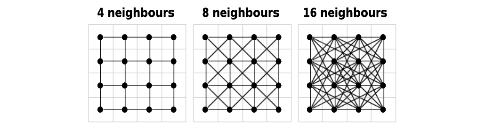

```{r codeChunkSetUp, include = FALSE}
source('../../codeChunkSetUp.R')
```


When working in Ecology, it is often necessary to produce maps and calculate distances between objects such as sampled stations, species distribution ranges or geographical features. A [tutorial on this blog](/tuto/rinspace/rinspace_homepage/) describes many techniques to create maps with different packages in R, such as `sf` and `raster`. In this post, I will go further and use these tools to calculate distances in our spatial environment.


# How to define a distance?

Before stepping in our topic, let's define what we are talking about. What is a *distance*? This concept has various applications in ecology we need to present here, to make sure we are on the same page.

Distances are frequently used to describe how the characteristics of two (or more) samples are different from each other (abiotic parameters, species composition, functional traits...). This particular definition presents a distance as an index of similarity/dissimilarity. Such indices include functions like Euclidean distance, Sørensen coefficient, Bray-Curtis dissimilarity or Mahalanobis distance, which can be applied to different types of data with different results (see Legendre & Legendre 2012). We will not cover these aspects here, more information can be found in Chapter 7 of *Numerical Ecology*, which is a must-have for every ecologist!

Instead of using a distance as a ressemblance measure, we will use it with its first meaning: a measure of how distant in space two points are. The most straightforward geographical measure is the Euclidean distance, based on Pythagoras' theorem of triangular equality. In an Euclidean plane, we will compute the difference between the X and Y coordinates of two points A and B (other formulae can be found for different coordinate systems):

$$D_{A,B} = \sqrt{(x_{B} - x_{A})^{2} + (y_{B} - y_{A})^{2}}$$

<center>  </center>


# Geographical distances and the problem of heterogeneity

Let's choose a concrete example: let me introduce Herbert the lobster. Herbert is a wild lobster living in the bay of Sept-Îles (Québec, Canada).

<center> {width=40%} </center>

We, as researchers, are interested in knowing the connectivity of its actual distribution to other potential living places close by. Why so? Because it is a crucial piece of information to predict its future distribution under a scenario of habitat loss due to human perturbation!

Euclidean distance is a great tool to calculate the distance between initial and potential living places for Herbert, assuming the space between these locations is homogeneous. Typically, marine ecosystems are particularly relevant for this measure. However, depending on the scale and/or location, the presence of islands, bays or anthropogenic structures can be problematic as they constitute barriers between locations that a species cannot cross. Distances 'as the crow flies' will then be meaningless!

So what do we do? Well, we can still use the Euclidean distance, but with the specification of forbidden regions in the space we are considering. Then, the path between the two locations will not be straight anymore (as above), but with intermediate steps only in allowed regions. In this case, many different paths can exist, so we will have to compute all possible paths between the start and end point, then select the best one *i.e.* the path with the shortest distance.

<center> )](Figures/Pathfinding1.gif) </center>

This is a frequent problem used for many applications, in particular for artificial intelligence (robot movements, characters evolution in video games...). Many algorithms exist to answer this problem, with various computational performances, as some problems can be highly difficult to solve! One of the most widely used algorithm in the one proposed by Dijkstra in 1959 that allows to add weights for path points. We won't go into details here, but remember that Dijkstra's algorithm is used in the methods presented below.


# Applications in R

We will work with the `sf` package (Pebesma 2018), as described in the previous [inSileco GIS series](/tuto/rinspace/rinspace_homepage/). Also, we present here a case study with *point* data, but these methods can be adapted to *lines*, *polygons* or *objects with multiple geometries*.

First, we will have to import the shapefile of the study area. All shapefiles are projected with the WGS84 (EPSG code: 4326) coordinate reference system (CRS), but analyses will be done with the UTM 19N (EPSG code: 32619) CRS. UTM consideres units in meters instead of degrees, *i.e* it is a projected CRS with corrections for longitude and latitude, and we use UTM 19N which includes the area of Sept-Îles.

```{r import1, results="hide", warning=FALSE, eval=TRUE}
library(knitr)
library(sf)
library(sp)

bay <- st_read("Data/poly_bay.shp") %>%
       st_transform(crs = 32619)

coords <- data.frame(station = c("INIT", "P1", "P2", "P3"),
                     longitude = c(-66.437, -66.508, -66.363, -66.385),
                     latitude = c(50.152, 50.162, 50.133, 50.095))

coords <- st_as_sf(coords, coords = c("longitude", "latitude"),
                   crs = 4326, stringsAsFactors = FALSE) %>%
          st_transform(crs = 32619)
```

```{r plot1, echo=FALSE, warning=FALSE, eval=TRUE}
par(mar = c(3, 3, 1, 1))
plot(st_geometry(bay), axes = TRUE, main = "", col = "#E2E2E2", border = "#C1C1C1")
plot(coords, cex = 2, pch = 16, add = TRUE)
text(x = st_coordinates(coords)[,"X"],
     y = st_coordinates(coords)[,"Y"],
    labels = coords$station, pos = 3, font = 2)
```

The initial position of Herbert is on the turquoise dot (init), and we are interested in three possible locations (P1, P2 and P3).


## Classic geographical distances

We can compute the Euclidean distances between each points by using `sf::st_distance()`. Let's try this here, even if we know that we do not consider the coast as a forbidden area.

```{r distances1, warning=FALSE, eval=TRUE}
dist1 <- st_distance(x = coords[1,], y = coords[-1,])

dist1_df <- data.frame(dist1, row.names = "Distance from init:")
colnames(dist1_df) <- c("P1", "P2", "P3")

kable(dist1_df)
```

Based on these results, P1 is the closest site to the initial location of Herbert implying that P1 could be the preferential site where he would migrate under the human perturbation scenario (where its initial position would not be available anymore). However, we know that Herbert, even if he is an awesome lobster, cannot go on land which is necessary to attain P1. So, we need to refine our analysis to take this into account.

```{r plot2, echo=FALSE, warning=FALSE, eval=TRUE}
par(mar = c(3, 3, 1, 1))
plot(st_geometry(bay), axes = TRUE, main = "", col = "#E2E2E2", border = "#C1C1C1")
plot(coords, cex = 2, pch = 16, add = TRUE)
text(x = st_coordinates(coords)[,"X"],
     y = st_coordinates(coords)[,"Y"],
     labels = coords$station, pos = 3, font = 2)

lines(x = st_coordinates(coords)[c(1,2),"X"],
      y = st_coordinates(coords)[c(1,2),"Y"],
      col = "#FF0000", lwd = 4)
lines(x = st_coordinates(coords)[c(1,3),"X"],
      y = st_coordinates(coords)[c(1,3),"Y"],
      col = "#A1A1A1", lwd = 2)
lines(x = st_coordinates(coords)[c(1,4),"X"],
      y = st_coordinates(coords)[c(1,4),"Y"],
      col = "#A1A1A1", lwd = 2)
```


## Least Cost Distances with `gdistance`

To take the geographical barriers into consideration, we will use the package `gdistance`, which have a very useful sets of functions to calculate functions (ven Etten 2017). In particular, `costDistance()` will do the trick. To use it, we will need to convert our polygon for the Bay of Sept-Îles to a raster specifying which cell can be considered by the pathfinding and so:

- forbidden cells will have a value of 0;
- allowed cells will have a value of 1 (each cell has the same "cost", meaning no weighting have been applied for particular paths).

> Note that the calculation is highly dependent on the **raster resolution**. A better resolution will bring better results, but at the cost of computing resources. Also, the cells of this raster are **squares**.

```{r import2, warning=FALSE, eval=TRUE}
library(gdistance)
library(raster)
```

```{r rastering, warning=FALSE, eval=TRUE}
raster_bay <- raster(x = extent(bay), nrow = 250,  ncol = 250)
raster_bay <- rasterize(x = bay, y = raster_bay, field = 1)
raster_bay[is.na(raster_bay)] <- 0
```

```{r plot3, echo=FALSE, warning=FALSE, eval=TRUE}
par(mar = c(3, 3, 1, 1))
plot(raster_bay)
```

> We have to add `field = 1` in function `rasterize()` otherwise the id number will be automatically assigned to each cell as a weighting parameter, which will bias the distance calculation by introducing a cost for choosing the cell.

Before calculating the distance, `costDistance()` needs a transition matrix. This matrix is an object that will define the cost to choose a cell (which in our case is inherited from the values of `raster_bay`) and the direction from which it is possible to choose a cell as the next one in the path. The direction is based on movements of soldiers on a chessboard:

- `4` is only from straight lines, *i.e.* rooks in chess;
- `bishop` is only from diagonal lines, *i.e.* bishops;
- `8` is straight and diagonal lines, *i.e.* queen;
- `16` is straight, diagonal lines and tilted diagonals, *i.e.* queen and knights.

<center>  </center>

The `geoCorrection()` function is needed to apply a correction to the transition matrix so that units and map distortion are taken into account (this may be more or less relevant depending on the CRS used).

```{r transition, warning=FALSE, eval=TRUE}
raster_bay_tr <- transition(raster_bay, transitionFunction = mean, directions = 16)
raster_bay_tr <- geoCorrection(raster_bay_tr, type = "c")
```

> The `type` argument defines the correction method for longitude and latitude. For the Least Cost Distances, `type = "c"` corrects coordinates in an East-West direction. If you want to use other algorithms such as Random Walks, you can use `type = "r"` to apply a correction in a North-South direction.

And now, let's calculate distances with the least cost path analysis!

```{r distances2, warning=FALSE, eval=TRUE}
dist2 <- costDistance(raster_bay_tr,
                      fromCoords = as(as_Spatial(coords[1,]), "SpatialPoints"),
                      toCoords = as(as_Spatial(coords[-1,]), "SpatialPoints"))

dist2_df <- data.frame(dist2, row.names = "Distance from init:")
colnames(dist2_df) <- c("P1", "P2", "P3")

kable(dist2_df)
```

> `costDistance()` needs a conversion to `SpatialPoints` class, as the package has been created with `sp` objects.

These results show that P2 is the closest potential site for Herbert now, without any coast between the two points. This result is much more relevant than previously calculated with `st_distance()`! If you want to represent the shortest path between two points (based on the transition matrix), you can plot the result of function `shortestPath()`.

```{r plot4, echo=FALSE, warning=FALSE, eval=TRUE}
par(mar = c(3, 3, 1, 1))
plot(st_geometry(bay), axes = TRUE, main = "", col = "#E2E2E2", border = "#C1C1C1")
plot(coords, cex = 2, pch = 16, add = TRUE)
text(x = st_coordinates(coords)[,"X"],
     y = st_coordinates(coords)[,"Y"],
     labels = coords$station, pos = 3, font = 2)

plot(shortestPath(raster_bay_tr, as_Spatial(coords)[1,], as_Spatial(coords)[2,],
                  output = "SpatialLines"), col = "#A1A1A1", lwd = 2, add = T)
plot(shortestPath(raster_bay_tr, as_Spatial(coords)[1,], as_Spatial(coords)[3,],
                  output = "SpatialLines"), col = "#FF0000", lwd = 4, add = T)
plot(shortestPath(raster_bay_tr, as_Spatial(coords)[1,], as_Spatial(coords)[4,],
                  output = "SpatialLines"), col = "#A1A1A1", lwd = 2, add = T)
```


## Least Cost Distances with `igraph`

The `gdistance` package is excellent, but not particularly flexible. You may need a custom workflow if you need to handle very large datasets or you want to use a hexagonal grid (*i.e.* you don't want to worry about chessboard moves). If this is so, you will need package `igraph` (Csardi & Nepusz 2006).

```{r import3, warning=FALSE, eval=TRUE}
library(igraph)
```

Let's create another grid, but this time, let's make it hexagonal. For this example, the cell centroids are 250m apart (in any of the 6 directions), but you could increase the resolution if you don't mind waiting a bit. As you can see from the map below, this resolution may ignore the presence of some smaller islands, which can be a problem.

```{r hex, warning=FALSE, eval=TRUE}
hex_bay <- st_make_grid(bay, cellsize = 250, square = FALSE)
```

```{r plot5, echo=FALSE, warning=FALSE, eval=TRUE}
par(mar = c(3, 3, 1, 1))
plot(st_geometry(bay), axes = TRUE, main = "", col = "#E2E2E2", border = "#C1C1C1")
plot(hex_bay, col = "#FFFFFF00", border = "#0300FF", add = TRUE)

# ggplot(bay) +
#   geom_sf(size = 1) +
#   geom_sf(data = hex_bay, col = "blue", fill = "transparent") +
#   geom_sf(data = coords, aes(col = station, fill = station)) +
#   geom_sf_label(data = coords, aes(label = station), nudge_y = 1000)+
#   theme_bw()
```

Now that we have our basic grid, we need to create an `igraph` network. The network in this case will represent neighbouring cells (*i.e.* right next to one another) which Herbert has the possibility to move through. We must first create an edgelist (*i.e.* list to 'from' and 'to' cell id's that represent neighbours), then convert into a network.

```{r edge, warning=FALSE, eval=TRUE}
edgelist <- as.matrix(as.data.frame(st_intersects(hex_bay)))
  # yes, the as.matrix and as.data.frame is a bit silly, but required to have the right format

gr <- graph_from_edgelist(edgelist)
```

```{r plot6, echo=FALSE, warning=FALSE, eval=TRUE}
plot(gr)
```

Yes, this plot no longer looks like the bay because we have abstracted out the actual coordinates and are looking only at the distances between cells. In this particular example we know that the distance between each neighbouring cell is 250m since we defined this when we created the grid. At this phase, you could also incorporate 'fancier' weights that incorporate habitat resistance (*i.e.* the influence of habitat type on the facilitation or prevention of movement) to calcuate isolation by resistance. But for this example, let's keep it simple.

```{r weight, warning=FALSE, eval=TRUE}
E(gr)$weight <- 250
  # setting the weight for ALL edges, alternatively could supply a vector here
```

Now we have a weighted graph ready for Least Cost Path analysis! We just need to figure out where the stations are relative to the hexagonal grid.

```{r distances3, warning=FALSE, eval=TRUE}
whereisHerbert <- as.numeric(st_intersects(coords, hex_bay))
dist3 <- distances(gr, whereisHerbert[1], whereisHerbert[-1])

dist3_df <- data.frame(dist3, row.names = "Distance from init:")
colnames(dist3_df) <- c("P1", "P2", "P3")

kable(dist3_df)
```

You will notice that we find a comparable result from what we calculated previsouly with `gdistance` (P2 being the closest potential site), even if this is a bit further than the `gdistance` estimates. This is likely mostly because of the difference in resolution (and somewhat because of cell shape).

If you are just calculating a handful of distances such as in this example, `gdistance` is probably faster. But if you are doing millions, `igraph` is typically more effective since much of the work is done 'upfront' when you create the graph. It would also be possible to create an `igraph` network from a `gdistance` transition raster which would combine the best of both packages.

Techniques above will be highly useful for many research questions, *e.g.* determining the influence of a perturbation in an ecosystem, characterizing species movements or community connectivity... The method presented in this post is one of the many that exist to answer these questions. You can find many tutorials for softwares like ArcGIS or QGIS, but I thought a simple presentation for R users would be welcomed. Enjoy!

<center>  </center>


# References

- Csardi G, Nepusz T (2006). The igraph software package for complex network research. *InterJournal*, Complex Systems 1695. http://igraph.org
- Dijkstra EW (1959). A note on two problems in connexion with graphs. *Numerische Mathematik* 1:269–271. doi:10.1007/BF01386390
- Legendre P, Legendre L (2012). Numerical Ecology, 3rd edition.
- Pebesma E (2018). Simple Features for R: Standardized Support for Spatial Vector Data. *The R Journal*,
  https://journal.r-project.org/archive/2018/RJ-2018-009/
- van Etten J (2017). R Package gdistance: Distances and Routes on Geographical Grids. *Journal of Statistical Software* 76(13). doi:10.18637/jss.v076.i13.

<details>
<summary>Session info <i class="fa fa-cogs" aria-hidden="true"></i></summary>
```{r sessionInfo}
sessionInfo()
```
</details>
