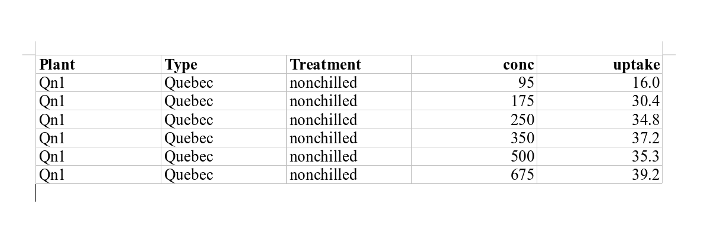

```{r codeChunkSetUp, include = FALSE}
knitr::opts_chunk$set(
  comment = "#R>",
  collapse = TRUE,
  fig.align = 'center',
  width = 100
)
library(inSilecoRef)
```

In the [first part of this post](/2020/04/05/insilecomisc-0.4.0-part-1/2/)  I
introduced several functions available in the package `r url_gh("inSilecoMisc",
"inSileco")`. In this post, I keep on introducing features of the package you
might find useful! If you did not read the first part of this post and are
interested in reproducing the examples below, simply install `inSilecoMisc` using the following:


```R
install.packages("remotes") # if not already installed
remotes::install_github("inSileco/inSilecoMisc")
```

Load it:

```{R}
library("inSilecoMisc")
packageVersion("inSilecoMisc")
```

You're good to go!


## scaleWithin()

I wrote [`scaleWithin()`](https://insileco.github.io/inSilecoMisc/reference/scaleWithin.html) to easily handle color scale for a specific, yet frequent, situation. Let say I have a 40 values in a vector `val` that are percentages (so distributed between 0 and 100)

```{R}
val <- runif(40, 0, 100)
val
```

**and** that I need to create a color scale with 25 tones (I used [`showPalette()`](http://insileco.github.io/graphicsutils/reference/showPalette.html) to show the color palette):

```{R}
pal <- colorRampPalette(c("#f9fa98", "#500127"))(25)
graphicsutils::showPalette(pal)
```

**But** the color scale should be used for the range [30%-70%] (values below should have the lowest values and values above, the highest one), in the caption you would indicate ($\geqslant$ 30% and $\leqslant$ 70%). Then `scaleWithin()` comes in handy

```{R}
scaleWithin(val, n = 25, mn = 30, mx = 70)
graphicsutils::showPalette(pal[scaleWithin(val, n = 25, mn = 30, mx = 70)], add_codecolor = FALSE)
```

Even though this function is, in my opinion, pretty useful, I had a lot of trouble explaining why! So, in the last version of `inSilecoMisc` I re-wrote its entire documentation and I hope that together with this example, others will find it useful.


## Messages

In my day to day I **use** R packages, R functions to analyse data, create
model, run simulations, etc. So I write scripts that combine functions for
various packages to create pipelines that do the analysis I need. In these
scripts, I like having information reported when they are running and I like
having a nice clear visual and that is why I value packages such as
`r url_cran("progress")`, `r url_cran("crayon")` and `r url_cran("cli")`. In
`inSilecoMisc`, inspired by messages reported by `r url_cran("devtools")` when
building a package, I created four simple message functions using the two latter
package to standardize the message in my scripts

```{R}
# 1. msgInfo() indicates what the upcoming computation
msgInfo("this is what's gonna happen next")
```

```{R}
# 2. msgWarning() reminds me something important that should not affect the run
msgWarning("Got to be careful")
```

```{R}
# 3. msgError() when something went wrong (and I anticipated that it could happen)
msgError("Something wrong")
```

```{R}
# 4. msgSuccess() when a step/ a computation has been successfully completed
msgSuccess("All good")
```

These functions help me structuring my scripts, here is a somewhat contrived example:

```{R}
scr_min <- function() {
  # msgInfo() lets me know where I am in the script
  msgInfo("Average random values")
  set.seed(111)
  out <- mean(runif(100))
  msgSuccess("Done!")
  # msgSuccess() indicates the successful completion of this part
  out
}
scr_min()
```

Another helpful aspect of these functions is that they all are based on `message()` and so, if I want to execute a script quietly all I need to do is to call `suppressMessages()` beforehand

```{R}
# quiet run
suppressMessages(scr_min())
```

Note that if you want to see how I used it in a script use for a manuscript,
check out the research compendium
[coocNotInteract](https://github.com/TheoreticalEcosystemEcology/coocNotInteract).


## tblDown()

Last but not least, I'd like to introduce a function to quickly export a
data frame (or a list of data frames) in various formats. I actually created
[`tblDown()`](https://insileco.github.io/inSilecoMisc/reference/tblDownn.html)
for a colleague of mine that was looking for a quick way to export a table. In
the package `r url_cran("knitr")`, there is the very handy function `kable()`
that quickly writes a data frame in various formats.

```{R}
knitr::kable(head(CO2))
```

All I did was writing a function that calls `kable()` to write the data frame
and then calls [pandoc](https://pandoc.org/) to render the table(s) in the
desired format that is indicated by the extension of the output file (`docx` by
default).


```{R}
# NB tblDown(head(CO2)) returns table.docx by default
tblDown(head(CO2), output_file = "table.odt")
```

<center></img></center>


As I mentioned above `tblDown()` handles lists of data frames and the user can also pass a set of captions for every table and even seprate then with section header (header 1)

```{R}
tblDown(list(head(CO2), tail(CO2)), output_file = "tables.pdf",
  caption = c("This is the head of CO2", "This is the tail of CO2"),
  section = "Table")
```

Check out the output file :arrow_right: [<i class="fa
fa-file-pdf-o"></i>](tables.pdf)! Not that in the example above I only use one
character string for `section` and `tblDown()` has appended an index, this is
also the default behavior for `caption` : if there is less captions
or sections titles than data frames, vectors of captions (and/or sections) are repeated and a index is appended.


Note that if you are already writing your documents with [R
Markdown](https://rmarkdown.rstudio.com/), you may not need this, but still
`tblDown()` quickly exports tables in various formats with only one line of
command!


#### That's all folks :tada:!


<br><br>
<details>
<summary>
  <h4>
    <i class="fa fa-cogs" aria-hidden="true"></i> Session info
    <i class="fa fa-chevron-down" aria-hidden="true"></i>
  </h4>
</summary>

```{R sessionInfo}
sessionInfo()
```
</details>
