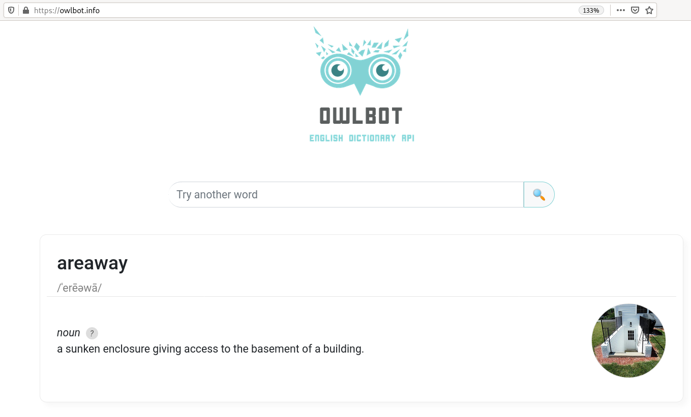
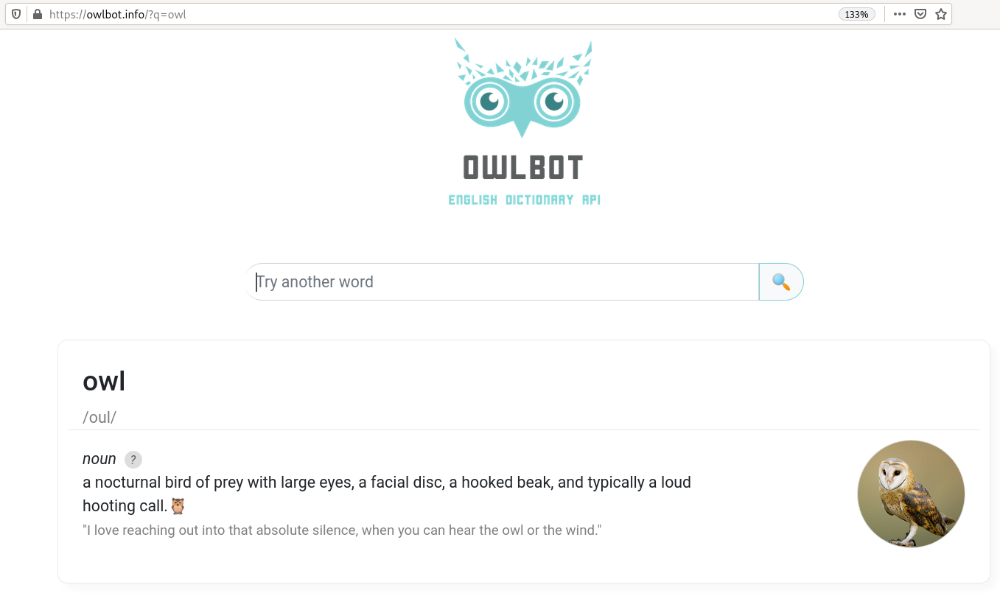

The web is a vast ocean of data, some of them are organized in databases and some of the are exposed via [Web APIs](https://en.wikipedia.org/wiki/Web_API). 

Over the past three years, I had few experiences writing R clients for web API: 
I maintain [`rcites`](https://CRAN.R-project.org/package=rcites), I contributed to 
[`rmangal`](https://CRAN.R-project.org/package=rmangal) (maintained by [Steve Vissaut]()), I made contribution to various other projects. I have also worked on projects that are hosted on GitHub and will probably never end up on CRAN, cause I think that's where they should be! [rowlbot](https://github.com/inSileco/rowlbot) is one of those projects, I started it fo fun, but as I were thinking that I should jot notes about R clients, [rowlbot](https://github.com/inSileco/rowlbot)  turned out to a good case example. In what follows I expand a bit on what are R client for web API and I detail a bit how I worked on `rowlbot`, while doing I have tried to gather a valuable links and references as links. 


## R programmatic interfaces for web APIs
  
### Data Access via web API
  
The web is a vast ocean of data, some of them are organized in databases and some of the data in data base are exposed via [Web APIs](https://en.wikipedia.org/wiki/Web_API). 
  
  
, see the post ["Ever wondered what happens when you type in a URL in an address bar in a browser?"](https://dev.to/wassimchegham/ever-wondered-what-happens-when-you-type-in-a-url-in-an-address-bar-in-a-browser-3dob).](lya7b81ow94pniln3aif.jpg){width=900 alt="><"}


In my opinion, the wikipedia article API [Web APIs](https://en.wikipedia.org/wiki/Web_API) already porvcide abluable informatrion, and I quote what I need here. 

The web is a vast ocean of data, some of them are organized in databases and some of the data in data base are exposed via [Web APIs](https://en.wikipedia.org/wiki/Web_API). In my opinion, the wikipedia article API [Web APIs](https://en.wikipedia.org/wiki/Web_API) already porvcide vabluable informatrion, and I quote what I need here. 

Server side: 

> A server-side web API is a programmatic interface consisting of one or more publicly exposed **endpoints** to a defined request–response message system, typically expressed in JSON or XML, which is exposed via the web—most commonly by means of an HTTP-based web server.

So basically one send a request, via URL, then  and the responses as JSON or XML. 

HTTP requests are posted, then 


Just like a webpage is rendered, APIs can use HTTP requests to get information from a web application or web server.  

https://techolution.com/types-of-apis/


Olwbo Engli disctionary API is one of thos web abit 

{width=900 alt="><"}


by default result of a randon request. 

that can 
Instead of a page we can. Every click is actually. 


basically use query 


{width=900 alt="><"}


owlbot will provide the service, when you enter use its own API! 
This is the impotrrnat distingtion, cause when writting the client, I am not trying to access the pacjage, byut the information delivered that owlbot use as website, 
In that case, difficult to make the discution acaseu the website side is mininmal and is dedicated for the api, bit you can imaginate a biger website that use extensiveky, 
same API bu different website!! 


> https://owlbot.info/?q=owl


A few concepts: 

- URI 
- Endpoints 


[]()


### R clients

So, with web API, and various website use it and you so. You will see a filed text, 
enter you request and then click and the answer (e.g. )

retrieving data directly in R, do do sone anayalu,

There are various nice topic about this, especially ropenci 
Very powerful and safe. Lots of packages on ropensci are of this sort and nake my work very easy! Shout out to all contributer (and I guess Scoot is the ine with the most package of the sort!) Scott, making a lot of useful packages (and tons of package of the sort I describe here! So please, have a look at his contribution! 

R clients, R interfaces, R programmatic interfaces for web APIs are plentiful. 
Ropenscience has tens of such [see data Access](https://ropensci.org/packages/data-access/). An R programmatic interface to the Orcid public API. and for all of them report use cases. 


A few example are listed belwo: 

```{R clients, echo = FALSE}
lsr <- yaml::yaml.load_file("rclients.yaml")
df <- do.call(rbind, lapply(lsr, as.data.frame))
df$api.name <- paste0("[", df$api.name, "]", "(", df$api.url, ")")
df[, 4] <- paste0("[", df$name, "](https://CRAN.R-project.org/package=", df$name, ")") 
df <- df[, c(1:2, 4, 3, 5)]
names(df) <- c("Package", "GitHub repository", "CRAN package page", "Web API", "Maintainer")
knitr::kable(df, format = "html")
```


Scott Chamberlain lots of and tools to help building then for instance ckan, pt as published making tin of then. 


## The R package rowlbot


### rowlbot in a nutshell 


So, [rowlbot](https://github.com/inSileco/rowlbot) is a R client for the [Owlbot](https://owlbot.info/) Owlbot Dictionary API. But also because it is a very good example of dealing wit an web API. Give it a try! 
 


rowlbolt is one of such http client that use URL to obtain information. []() cause it retune a definition. 

You need a token that you can easily get by clicking. 


### rowlbot in numbers 

[cloc](https://github.com/AlDanial/cloc)

```shell
$ cloc .
     12 text files.
     10 unique files.                              
      5 files ignored.

github.com/AlDanial/cloc v 1.86  T=0.01 s (886.0 files/s, 97686.2 lines/s)
-------------------------------------------------------------------------------
Language                     files          blank        comment           code
-------------------------------------------------------------------------------
Markdown                         2            127              0            512
R                                4             14             21             82
YAML                             1             15              4             67
Rmd                              1             14             20              6
-------------------------------------------------------------------------------
SUM:                             8            170             45            667
-------------------------------------------------------------------------------
```

with tree 

```sh
$ tree -a -I .git
.
├── DESCRIPTION
├── .github
│   └── workflows
│       └── R-CMD-check.yaml
├── LICENSE.md
├── man
│   └── rowlbot.Rd
├── NAMESPACE
├── R
│   ├── rowlbot.R
│   └── zzz.R
├── .Rbuildignore
├── README_files
│   └── figure-markdown_strict
│       ├── unnamed-chunk-3-1.png
│       └── unnamed-chunk-4-1.png
├── README.md
├── README.Rmd
└── tests
    ├── testthat
    │   ├── owl.yml
    │   └── test_basic.R
    └── testthat.R
```


Note that there is also a [R package cloc](https://github.com/hrbrmstr/cloc)

There will be only a single endpoint we need to 


### Handling the token 

The API


https://ropensci.org/technotes/2020/07/07/github-pat/


### Sending Request 

https://cran.r-project.org/web/packages/httr/vignettes/api-packages.html

I have used [`httr`](https://CRAN.R-project.org/package=httr) that comes with some 
valuable including [Best practices for API packages](https://httr.r-lib.org/articles/api-packages.html) that is very helpful. 


Here I discuss basically what we need. I need to request so I need to use the right url and my token 

- "owl"
- my token. 

rowlbot <- function(word) {
    out <- rob_res(rob_url(word))
    class(out) <- "rob_def"
    out
}


https://owlbot.info/api/v4/dictionary/owl
+ token added to your request as an header *Authorization* see [list on Wikipedia](https://en.wikipedia.org/wiki/List_of_HTTP_header_fields#Standard_request_fields). 


### Dealing with the response 


```R 
Response [https://owlbot.info/api/v4/dictionary/owl]
  Date: 2020-10-27 17:56
  Status: 200
  Content-Type: application/json
  Size: 417 B
```

Json and can be target 

httr::GET(q_url, httr::add_headers(token), ...)


And so the 

"https://owlbot.info/api/v4/dictionary/owl"


and the request will be 


### Making the interface clear 


[`cli`](https://CRAN.R-project.org/package=cli) and [`crayon`](https://CRAN.R-project.org/package=crayon), just better display on information and impove calrity, not more not lass. I 


working on my machine


### HTTP testing 

I have less experience about this but I recently read about this topic because 
we might need it for rmangal as we repetitilevely have some minir isssur to the 
AMangal APIm not the package itself. 


As well explained in [this post by Scott Chamberlain](https://ropensci.org/technotes/2019/12/11/http-testing/), we need tests for robustness (check that the functions works, 
and that new changes does not affect the behavior). With R client, what we need 
is to test the client, no the API, but the client uses the API and thus when you test, 
issues. There are package to, in the  by Scott Chamberlain](https://ropensci.org/technotes/2019/12/11/http-testing/).

To not repeat what is best said by those who know more, I would like to mentiuon that 
I have found the logical behing [vcr](https://github.com/ropensci/vcr) (I did not [`httptest`](https://CRAN.R-project.org/package=httptest)) quite intuiti as you simply record the 
respond and, typically when developpin the play it again when, notably on CRAN,.. 

So 

```sh 
$ tree tests 
tests
├── testthat
│   ├── owl.yml
│   └── test_basic.R
└── testthat.R
```


```
context("Basic unit tests")
library(vcr)

test_that("Check one known entry", {
  vcr::use_cassette(name = "owl", {
    rq1 <- "owl"
    res1 <- rowlbot::rowlbot(rq1)
  })
  
  expect_equal(class(res1), "rob_def")
  expect_equal(res1$definitions[[1L]]$type, "noun")
  expect_equal(res1$word, rq1)
  expect_equal(res1$pronunciation, "oul")
})

```

produce `owl.yaml` and othersie 
Note tat library(vcr) is important, some set up. This work offline.!
