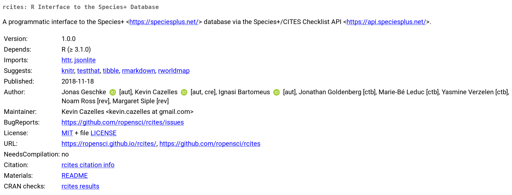

[Jonas Geschke](https://www.linkedin.com/in/jonasgeschke/),
[Ignasi Bartomeus](https://bartomeuslab.com/) and I have recently released [rcites v-1.0.0](https://cran.r-project.org/web/packages/rcites/index.html) on CRAN, a R client for the [Species+ API](https://api.speciesplus.net/) after it has been reviewed by [rOpenSci](https://rOpenSci.org/). In this post, I would like to share this recent experience as well as several valuable resources.

<br>

<center> {width=100%} </center>

<br>


## What is an R package?

In the introduction of his book [R packages](http://r-pkgs.had.co.nz/intro.html), Hadley Wickham wrote:

> A package bundles together code, data, documentation, and tests, and is easy to share with others.

I like the way the famous R developer presents a package, it is straightforward and crystal clear. Interestingly enough, it describes what a package *does*, not what a package *is*. Defining an R package is actually harder than I thought! I remember the first time, I've tried to characterize an R package, I tried to answer a couple of questions and found the answers quite surprising:

* Are R packages extensions available on [CRAN](https://cran.r-project.org/) or [Bioconductor](https://www.bioconductor.org/)? **Not necessarily!**

The answer sounds obvious nowadays with over than [40K R packages on Github](https://rdrr.io/), but 10 years ago it wasn't. That said, we shall recall that an R package that only exists on a single computer still is an R package.

* Should a package have a minimum number of functions? **No**

Even among popular packages, the number of functions is not a criterion. For instance, [vegan](https://cran.r-project.org/web/packages/vegan/) exports 192 functions (as of version 2.5.2) while [png](https://cran.r-project.org/web/packages/png/) only includes two functions.

* Should a package be designed to perform a specific analysis? **No**

Two comments here. First, R packages do many things: they [can turn R into a powerful Geographic Information System](/tuto/rinspace/rinspace_homepage/index.html) or make your R session crash every time you load it (see [trump](https://github.com/romainfrancois/trump))! Packages such as [ape](https://cran.r-project.org/web/packages/ape/) provide try to be as exhaustive as possible for a certain type of analysis while other such as [Hmisc](https://cran.r-project.org/web/packages/Hmisc/) are sets of miscellaneous functions. Second, it sometimes make more sense for development purposes to split the full pipeline into several packages so that more than one package are required for certain analysis.

So **what is an R package?** Well, my own definition would be something along this line:

> A set of files that passes the command `R CMD INSTALL`.

From this definition, one should understand that an R package does not perform
any analysis correctly. Rather, an R package is an organized set of files that
passes a set of tests, *a lot of tests*!


## Why write an R package?

This is another crucial question. In [his introduction](http://r-pkgs.had.co.nz/intro.html),
Hadley Wickham emphasized that R packages are a standard way to organize your
project: it saves you time, gives you an opportunity to acquire good practices when writing functions and makes the sharing of your code easy.
Once you get used to create and handle R packages, it becomes natural to use
the standard file organisation to structure your project. With this habit, the question "where is this file?" vanishes and you stop using `setwd()`. Note that, some authors propose similar structure of R projects, e.g. [this post on nicercode](https://nicercode.github.io/blog/2013-04-05-projects/), but you'll need to tweak a little bit if you want to test your code with standard tools.

I would like to point out that one of the main reasons of creating a package is for efficiency purposes, not necessarily to submit it to the CRAN. To me, this is *extremely* important. This means that you do not need to have a good reason to write a package, if you work regularly with R you can write packages, whenever you decide to turn your set of functions for a particular project into an actual package, then the step to do so will be small. Of course the sharing of your package is an important question, but I think this is different question: *If you write a package it does not imply you'll share it*.


## Why share your R package?

There are different answers to this question and depending on the answer, you
may consider different options to share your code. I do not intend to be exhaustive here rather I provide three examples I am familiar with.


### 1- My personal helper functions

When I keep repeating the same lines of code in a project, I write a function.
Sometimes, the function can actually be used in different projects. I used to write this kind of function in a dedicated `.R` file that was loaded during my custom startup process (see `?Startup` in R). Three years ago, I decided to make a package out of these functions. There were three main reasons for doing so. First, I was still learning how to write packages, so this was another opportunity to practice. Second, I wanted to document these functions. Last but not least, I thought these functions might be useful to other people so writing an R package was an efficient way to share them. The package is now on GitHub: [inSilecoMisc](https://github.com/inSileco/inSilecoMisc), everyone can use it, borrow one or more functions for his own project, report issues, etc. Even though the package is exhaustively tested, [inSilecoMisc](https://github.com/inSileco/inSilecoMisc) remains a collection of sub-optimal functions which according to me does not deserve to be published on the CRAN, GitHub and the additional web services I use cover all my needs!


### 2- The code to reproduce a paper

Reproducible science matters to me, when I publish a paper I cannot see any reason to not share the analysis pipeline with the rest of the scientific community: it demands a little more of my time to save a huge amount of time for them. To do so, I now create a small package that contains the analysis. The first time I did so was for a paper we did with a couple of colleagues where we compared [media coverage for climate change and biodiversity](https://www.frontiersin.org/articles/10.3389/fevo.2017.00175/ful). Unfortunately, we were not able to make the gathering of data reproducible (believe me, we've tried, the only solution was to work on private API, so, making the code not reproducible for the majority of researchers), we however turned the data collected into `.Rdata` files and the set of functions were stored on a GitHub repository: [burningHouse](https://github.com/KevCaz/burningHouse). This ensures the interoperability of the package, shows to other researchers how we did it the analysis and let them report issues with the code. Moreover, [Zenodo](https://zenodo.org/) makes it simple to assign a DOI to the repository so that people can reference this work if needed. Note that it becomes quite common for researchers to share their code that way, see for instance [this repository](https://github.com/hyenaproject/vullioud2018) associated with this [nice paper about the girl power in the clans of Hyenas](https://doi.org/10.1038/s41559-018-0718-9).


### 3- A R-Client for a web API

A year ago now, I was in a hackathon in Ghent (my first hackathon) and I sat on the same table as [Jonas Geschke](https://www.linkedin.com/in/jonasgeschke/), [Ignasi Bartomeus](https://bartomeuslab.com/) (among other colleagues). We worked intensively on a prototype of a package listed in [the wishlist of rOpenSci](https://github.com/rOpenSci/wishlist/issues/29):
an R-Client to the CITES-API. After we completed the first version, we [submitted it to the review process of rOpenSci](https://github.com/rOpenSci/onboarding/issues/244). And now [rcites is part of rOpenSci](https://github.com/rOpenSci/rcites) (more about this story [here](https://github.com/rOpenSci/roweb2/pull/344#issuecomment-442945039)). So here is a tangible example where the package is worth making the CRAN (I think so) and even a dedicated organization ([rOpenSci](https://github.com/ropensci)) on GitHub. The package is general, has a specific goal, helps people retrieving data to do science and helps them to do it in a reproducible way. So it should be broadly shared. Plus, making the package part of an organization such as rOpenSci means that the package will likely keep being maintained properly.


## How to proceed?

Below, I give a brief overview of how we proceeded for [rcites](https://cran.r-project.org/web/packages/rcites/index.html). Note that if you are interested in writing an R package, you must read more about what I am quickly mentioning below, so scroll down to the end of this post where I listed a couple of very helpful resources. After 3 years of experience with packages, I do not frequently have to look at documentation, but when I do, I always find the answers in [R packages](http://r-pkgs.had.co.nz/) or
[Advanced R](http://adv-r.had.co.nz/) both by Hadley Wickham or in the exhaustive and technical documentation [Writing R extensions](https://cran.r-project.org/doc/manuals/r-release/R-exts.html) available on the CRAN.


### Local development

I personally use the set of packages developed by Hadley Wickham and colleagues. His book [R packages](http://r-pkgs.had.co.nz/) explains how to write your package with them. Installing these packages and start working on package is a simple as the line of command below:

```R
install.packages(c("devtools", "roxygen2", "testthat", "knitr"))
```

Briefly:

- [roxygen2](https://cran.r-project.org/web/packages/devtools/index.html): document the functions;
- [testthat](https://cran.r-project.org/web/packages/devtools/index.html): test your code;
- [knitr](https://cran.r-project.org/web/packages/devtools/index.html): build the vignette;
- [devtools](https://cran.r-project.org/web/packages/devtools/index.html): rule them all! ([version 2.0](https://www.tidyverse.org/articles/2018/10/devtools-2-0-0/) has recently been released).


In a nutshell, the workflow with this setup looks like this:

```
1-"fix/write code" => 2-load_all() => 3-document() => 4-test() => 5-check()
```

Basically, you follow these steps for every feature you are adding to your package and go back to step 1- if one of the subsequent steps fails. The package [usethis](https://github.com/r-lib/usethis) is also worth mentioning as it automates many steps of the process. Moreover, `package.skeleton()`
creates a package skeleton for you and [Dirk Eddelbuettel](http://dirk.eddelbuettel.com/) has extended the function for packages that are linked to [Rcpp](http://www.rcpp.org/), see
[`Rcpp.package.skeleton()`](https://github.com/RcppCore/Rcpp/blob/master/R/Rcpp.package.skeleton.R).

I would like to conclude this part by pointing out that using the set of packages Hadley Wickham and colleagues isn't mandatory, but remember, their developers have cleverly automated many steps for writing R packages, so why not use the fruit of their labor?


### Version control and Continuous Integration

Web-based [<i class="fa fa-git" aria-hidden="true"></i>](https://git-scm.com/)-repository managers such (GitHub <i class="fa fa-github" aria-hidden="true"></i>, GitLab <i class="fa fa-gitlab" aria-hidden="true"></i>, Bitbucket <i class="fa fa-bitbucket" aria-hidden="true"></i>, etc.) are very powerful tools to develop your packages
especially to work with collaborators, get feed back and add web-services to improve your workflow. First, [<i class="fa fa-git" aria-hidden="true"></i>](https://git-scm.com/)
it-self is a fantastic tool (beyond the scope of this post, I recommend you the reading of [Pro Git](https://git-scm.com/book/en/v2)). Second, by hosting your package on GitHub, your are basically sending an invitation at large to contribute to your project: "hey devs, this is the project I am working on, if you are interested, please star, clone, fork, report issues, submit pull requests, etc."! Furthermore, once on GitHub, people can easily install your package directly from R:

```R
devtools::install_github("rOpenSci/rcites")
```

Last, the number of [web-services](https://github.com/marketplace) you can add to your repository is tremendous (sign in with GitHub and let the [protocol OAuth 2.0](https://oauth.net/2/) do the rest). There are two kind services I always use for all my R packages: [continuous integration (CI)](https://en.wikipedia.org/wiki/Continuous_integration) and [code coverage](https://en.wikipedia.org/wiki/Code_coverage). I would like to expand a little bit on this two.

#### Continuous integration

I personally use [Travis](http://docs.travis-ci.com/user/languages/r/) that covers MacOS +  Ubuntu and [AppVeyor](https://github.com/krlmlr/r-appveyor) for Windows. As [continuous integration services](https://www.slant.co/topics/186/~best-hosted-continuous-integration-services#8) they allow me to check that my package can be seamlessly built on different systems freshly installed, for a specific version of R. I am very grateful to developers that makes the use of this service really easy!

#### Code coverage

The code coverage is the percentage of coding lines checked by your
[unit testing](https://en.wikipedia.org/wiki/Unit_testing). Unit testing plays two critical roles. First, it checks that your code do what you want it to do. Second, once your tests are already written, they are extremely useful when you are fixing a bug, restructuring the code or adding new features as you can immediately be aware whether or not the changes you are doing affect the behavior of the other part of your package and therefore unit testing avoids multiplying bugs via side effects brought by the new lines of code. I personally use [testhat](https://cran.r-project.org/web/packages/testthat/index.html) to write my tests and [codecov](https://codecov.io/) to show the code coverage and benefit from the neat visualizations it automatically produces (see for instance the [results for rcites](https://codecov.io/gh/rOpenSci/rcites)). I must also mention that I've recently tried [coveralls](https://coveralls.io/) and I like its design very much, so I may use it more in a near future!
Many thanks to [Jim Hester](https://github.com/jimhester) for [his work on the integration of these services for R packages](https://cran.r-project.org/web/packages/covr/vignettes/how_it_works.html).


### License

Even though I am no expert on this topic, I can tell that choosing your license matters it specifies what people can do with your code. I recommend you to go and visit this website: ["ChooseALicense"](http://choosealicense.com) and if this question is critical to your project, you should better ask somebody that is knowledgeable about [Intellectual Property (IP)](https://en.wikipedia.org/wiki/Intellectual_property).


### Release on GitHub and on the CRAN

This topic is also well covered in Hadley's book, so I suggest you read [this chapter](r-pkgs.had.co.nz/release.html).
A release is an achievement, you have reached a milestone and the package works great, so you are basically spreading the news "I/we've reached a milestone guys, here it is!". Doing a release is as simple as changing the number of the version in the `DESCRIPTION` file. That said, there are ways of making it more official and more useful.

First on GitHub, you can [create releases](https://help.github.com/articles/creating-releases/). After editing the version number in `DESCRIPTION`, you can push and create a release and even add a DOI with the version via [Zenodo](https://zenodo.org/). You can also submit your package to the [CRAN](https://cran.r-project.org/) or [Bioconductor](https://www.bioconductor.org/) which demands a little more work.
Either way, at this stage you must choose a version number. Easy peasy? Yes, but this choice does matter. It is all about making the numbers used as meaningful as possible to provide useful landmarks as you keep on developing your package. [Semantic Versioning](http://semver.org) does a great work at explaining this, check this website out! I also suggest that you spend some time thinking about how useful it is to make the [version number converging to pi](https://en.wikipedia.org/wiki/TeX).

I have no experience submitting my package to [Bioconductor](https://www.bioconductor.org/). I can only tell about the [CRAN](https://cran.r-project.org/submit.html). I'll be brief as you can read how to do so in [Hadley's book](r-pkgs.had.co.nz/release.html):

1. You must test your package on the main platforms (MacOS, Windows, Linux) and report warnings/notes if any. Travis and AppVeyor I introduced above are very useful for this, if they are part of your workflow, basically this step is done, I however recommend to use [win-builder](https://win-builder.r-project.org/) (one command line `devtools::build_win()`) and also to have a look at [the r-hub builder](https://builder.r-hub.io/).

2. You must write the results in `cran-comments.md` where you must mention if it is your first submission and if your package has downstream dependencies.

Below is the [most recent one for rcites](https://github.com/rOpenSci/rcites/blob/master/cran-comments.md):

```md
## This is our second submission

## Test environments

* local Debian testing (4.18.0-2-amd64), R 3.5.1
* MacOSX 10.13.3 (on Travis-ci), R:release
* Ubuntu 14.04 (on Travis-ci), R 3.4.4, R:release, R:devel
* win-builder (R:release and R:devel)


## R CMD check results (win-builder)

There were no ERRORs, WARNINGs or NOTEs.

Installation time in seconds: 7
Check time in seconds: 99
Status: OK
R Under development (unstable) (2018-11-12 r75592)


## Downstream dependencies

There are currently no downstream dependencies for this package.
```

Once done, you are ready to submit, so thanks to [devtools](https://cran.r-project.org/web/packages/devtools/), just one command line:

```R
devtools::submit_cran()
```

After this, you'll receive an email (the one you wrote in the maintainer field of `DESCRIPTION`) to confirm the submission. You may receive emails from people that manage the CRAN because of issues or potential improvements. So far, they have given me one good advice: using `\donttest{}` instead of commenting out examples that cannot be tested on the CRAN.


## Why submit your package to a peer review process?

Let's assume your package is already on GitHub and the built passes on both Travis and Appveyor and that the code coverage is above 90%, is it enough? Does that mean you wrote a good package? What is a good package? To me, a good package does not need to be among most downloaded ones but rather one that is well coded. There are a set of criteria that can actually be objectively evaluated:

- **good practice**: is your package compliant to good practices? Given the number of ways R offers to do the same things, e.g. `<-` or `=` to assign a value to a variable (that puzzles some people), it is recommended to follow good practice. [goodpractice](https://github.com/MangoTheCat/goodpractice) checks if your package follows them. For instance, `goodpractice::gp()` checks that you are using `<-` rather than `=`, that your lines of code do not exceed 80 character, that you are using `TRUE` and `FALSE` instead of `T` and `F`, etc..

- **readability** is your code well-commented and easy to understand? This determines how easy it would be for new contributors to understand your code and thus how easy it would be for them to contribute. Note that for efficiency purposes, some steps may sometimes be hard to understand, in such case, you must comment how you did it and why, this is also relevant for the future you.

- **Dependencies**: there is nothing wrong with [depending on other packages](http://www.stat.tugraz.at/AJS/ausg121/121Hornik.pdf). However,
[being parsimonious and using adequate package matter](https://recology.info/2018/10/limiting-dependencies/) (the [Occam's razor](https://en.wikipedia.org/wiki/Occam%27s_razor) version for packages). The first release of [rcites](https://cran.r-project.org/web/packages/rcites/) imported [data.table](https://cran.r-project.org/web/packages/data.table/). During the review of the package [Noam Ross](https://github.com/noamross) suggested that data.table is actually used for efficiency purposes and that in the context of [rcites](https://cran.r-project.org/web/packages/rcites/), it was an extra dependency for no real benefice, which is true, so we changed this.

- **Code redundancy**: is your code a bunch of copy paste or is it well-designed so that it avoids redundancy and makes the debug efficient? This may sound technical but a code well-structured is also a code that is easy to debug and to further develop.

- **Efficiency** is your code efficient? There are many tips given by Colin Gillespie and Robin Lovelace in [Efficient R programming](https://csgillespie.github.io/efficientR/), have a look!

- **User experience** Never wondered why Hadley's packages are among the most popular ones? Well, he cares a lot about the users. I am sure he thinks a lot about how people will use a package and how to make it as intuitive as possible. Moreover, he exhaustively documents his works. This is a critical part. Making your package user friendly is about its design and documenting your package. Without a good documentation, you'll miss your shot. Build vignettes! Explain carefully how your package works, build a website! You can no longer say that this is hard because [pkgdown](https://pkgdown.r-lib.org/) makes this real easy!

To evaluate all these aspects, you (still) need human reviewers! That's why I value so much initiatives such as [rOpenSci](https://ropensci.org/), their members [review packages](https://ropensci.org/blog/2017/09/01/nf-softwarereview/), advertise the packages they've reviewed, write tutorials and [ blog on what they are doing](https://ropensci.org/blog/). Our experience was awesome, we had very positive feed back, very clever suggestions that made [rcites](https://github.com/ropensci/rcites) a better package. I would love to say more about it but guess what, the review process  in 100% transparent, so check out what really happened `=>` [](https://github.com/ropensci/onboarding/issues/244). You may wonder whether your package is in the scope of rOpenSci? How to submit your package? Well, they are completing a book to answer all this question, [check it out](https://ropensci.github.io/dev_guide/)! If your package is not in rOpenSci book, you have other options such as [The Journal of Open Source Software (JOSS)](https://joss.theoj.org) or [Journal of statistical software](https://www.jstatsoft.org/index). Note that [rOpenSci has Software Review Collaboration with Methods in Ecology and Evolution](https://ropensci.org/blog/2017/11/29/review-collaboration-mee/) and with JOSS. So in our case, it meant that [our JOSS paper](https://joss.theoj.org/papers/ad23e358f208568c4913cf5fb99a030d) was accepted after the review completed by rOpenSci.

There are [thousands of packages on the CRAN](https://cran.r-project.org/web/packages/), I personally
think that it is worth sending packages of good quality (again quality means that the package does what it was meant to do and does it well). After this experience, I'll always do my best to get reviews of the code before sending the package to the CRAN. People are sometimes wondering how to [trust an R package](https://simplystatistics.org/2015/11/06/how-i-decide-when-to-trust-an-r-package/), getting packages peer-reviewed is definitively a good solution.
For now on, my personal approach with R packages will be:

1. Development of GitHub (or similar);
2. Review;
3. Development until package accepted;
4. Submit first version to CRAN;
5. Advertise <i class="fa fa-twitter" aria-hidden="true"></i>, blog, etc.
6. Regular life cycle: new features/ fixing bugs / new release on CRAN when ready / keep advertising.


## Curated list of resources mentioned in the post


### Packages

- [devtools](https://github.com/r-lib/devtools/issues)
- [usethis](https://github.com/r-lib/usethis)
- [pkgdown](https://github.com/r-lib/pkgdown)
- [goodpractice](https://github.com/MangoTheCat/goodpractice)


### Builders

- [r-hub](https://r-hub.github.io/rhub/) see https://builder.r-hub.io/
- [win-builder](https://win-builder.r-project.org/)


### Documentation

- ["Writing an R package from scratch" by Hilary Parker](http://hilaryparker.com/2014/04/29/writing-an-r-package-from-scratch/) (that actually is the first thing I read on this topic)
- [Writing R extension, on the CRAN](https://cran.r-project.org/doc/manuals/r-release/R-exts.html)
- [R packages by Hadley Wickham](http://r-pkgs.had.co.nz/)
- [rOpenSci Packages: Development, Maintenance, and Peer Review](https://rOpenSci.github.io/dev_guide/)
- [Advanced R by Hadley Wickham](http://adv-r.had.co.nz/)
- [Efficient R programming by Colin Gillespie Robin Lovelace](https://csgillespie.github.io/efficientR/index.html)
- [Pro Git](https://git-scm.com/book/en/v2)

### Journals

- [R Journal](https://journal.r-project.org/)
- [The Journal of Open Source Software (JOSS)](https://joss.theoj.org/)
- [Methods in Ecology and Evolution (MEE)](https://besjournals.onlinelibrary.wiley.com/journal/2041210x), [it partnered up with rOpenSci](https://rOpenSci.org/blog/2017/11/29/review-collaboration-mee/)


### Misc

- [You can make a package in 20 minutes](https://www.rstudio.com/resources/videos/you-can-make-a-package-in-20-minutes/)


<br>

#### That's all folks!
