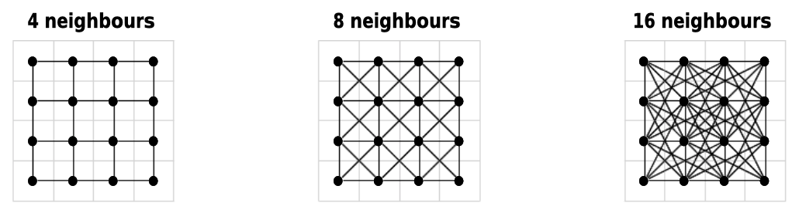

When working in Ecology, it is often necessary to produce maps and calculate distances between objects such as sampled stations, species distribution ranges or geographical features. A previous post in this blog described many techniques to create maps with different packages in R, like `sf` and `raster`. In this post, I will go further and use these tools to calculate distances in our spatial environment.

# How to define a distance?

Before steping in our subject, let's define what we are talking about. What is a *distance*? This concept has various applications in ecology we need to present here, so that we are all talking about the same thing.

Distances are frequently used to describe how the characteristics of two (or more) samples are different from each other (abiotic parameters, species composition, functional traits...). This particular definition presents a distance as an index of similarity/dissimilarity. Such indices include functions like Euclidian distance, Sørensen coefficient, Bray-Curtis dissimilarity or Mahalanobis distance, which can be applied to different types of data with different results (see *Legendre & Legendre 2012*). We will not cover these aspects here, more information can be found in Chapter 7 of *Numerical Ecology* which is a must-have for every ecologist!

Instead of using a distance as a ressemblance measure, we will use it with its first meaning: a measure of how distant in space two points are. The most straightforward geographical measure is the Euclidian distance, based on Pythagoras' theorem of triangular equality. In an Euclidian plane, we will compute the difference between the X and Y coordinates of two points A and B:

$$D_{A,B} = \sqrt{(x_{B} - x_{A})^{2} + (y_{B} - y_{A})^{2}}$$


Many other exists, which can be used with different coordinate systems.

# Geographical distances and the problem of heterogeneity

Let's choose a concrete example: let me introduce Herbert the lobster. Herbert is a wild lobster living in the bay of Sept-Îles (Québec) and we, as researchers, are interested in knowing the connectivity of its actual distribution to other potential living places close by, in the context of predicting future distribution under a scenario of habitat loss due to human perturbation.


Euclidian distance is a great tool to calculate the distance between initial and potential living places for Herbert, assuming the space between these locations is homogeneous. Typically, marine ecosystems are particularly relevant for this measure. However, depending on the scale and/or location, the presence of islands, bays or anthropogenic structures can be problematic as they consitute barriers between locations that a species cannot cross. Straight distances will then be meaningless!

So what to do? Well, we can still use the Euclidian distance, but with the specification of forbidden regions in the space we are considering. Then, the path between the two locations will not be straight anymore (as above), but with intermidiate steps only in allowed regions. In this case, many different paths can exist, so we will have to compute all possible paths between the start and end point, then select the best one *i.e.* the path with the shortest distance.


This is a frequent problem used for many applications, in particular for articifial intelligence (robot movements, characters evolution in video games...). Many algorithms exist to answer this problem, with various computational performance, as some problems can be highly difficult to solve! One of the most widely spread is Dijkstra's algorithm (*Dijkstra 1959*), where it is possible to add weights for path points. We won't go into details about these algorithms as this is not the topic of this post, but remember that Dijkstra's algorithm is used in the methods presented below.

# Application in R

We will work with the `sf` package, as described in the previous [InSileco GIS series](https://insileco.github.io/tuto/rinspace/rinspace_homepage/) (*Pebesma 2018*).

First, we will have to import the shapefile of the study area. All shapefiles are plotted in the WGS84 CRS (EPSG code: 4326), but analyses will be done in the UTM19N CRS (EPSG code: 32619).

```{r import1, results="hide", warning=FALSE}
library(knitr)
library(sf)
library(sp)

bay <- st_read("Data/poly_bay_BSI.shp") %>%
       st_transform(crs = 32619)

coords <- data.frame(station = c("INIT", "P1", "P2", "P3"),
                     longitude = c(-66.437, -66.508, -66.363, -66.385),
                     latitude = c(50.152, 50.162, 50.133, 50.095))

coords <- st_as_sf(coords, coords = c("longitude", "latitude"), crs = 4326, stringsAsFactors = F) %>%
          st_transform(crs = 32619)
```

```{r plot1, echo=FALSE, warning=FALSE, fig.align="center"}
par(mar = c(3, 3, 1, 1))
plot(st_geometry(bay), axes = T, main = "", col = "#E2E2E2", border = "#C1C1C1")
plot(coords, cex = 2, pch = 16, add = T)
text(x = st_coordinates(coords)[,"X"],
     y = st_coordinates(coords)[,"Y"],
    labels = coords$station, pos = 3, font = 2)
```

The initial position of Herbert is on the turquoise dot ("init"), and we are interested in three possible locations (P1, P2 and P3).


## Classic geographical distances

We can compute the Euclidian distances between each points by using `sf::st_distance()`. Let's try this here, even if we know that we do not consider the coast as a forbidden area.

```{r distances1, warning=FALSE}
dist1 <- st_distance(x = coords[1,], y = coords[-1,])

dist1_df <- data.frame(dist1, row.names = "Distance from init:")
colnames(dist1_df) <- c("P1", "P2", "P3")

kable(dist1_df)
```

Based on these results, P1 is the closest site to the initial location of Herbert implying that P1 could be the preferential site where he would migrate under the human perturbation scenario where its initial position would not be available anymore. However, we know that Herbert, even if he is an awesome lobster, cannot go on land (which is necessary to attain P1), so we need to refine our analysis to take this into account.

```{r plot2, echo=FALSE, warning=FALSE, fig.align="center"}
par(mar = c(3, 3, 1, 1))
plot(st_geometry(bay), axes = T, main = "", col = "#E2E2E2", border = "#C1C1C1")
plot(coords, cex = 2, pch = 16, add = T)
text(x = st_coordinates(coords)[,"X"],
     y = st_coordinates(coords)[,"Y"],
     labels = coords$station, pos = 3, font = 2)

lines(x = st_coordinates(coords)[c(1,2),"X"],
      y = st_coordinates(coords)[c(1,2),"Y"],
      col = "#FF0000", lwd = 4)
lines(x = st_coordinates(coords)[c(1,3),"X"],
      y = st_coordinates(coords)[c(1,3),"Y"],
      col = "#A1A1A1", lwd = 2)
lines(x = st_coordinates(coords)[c(1,4),"X"],
      y = st_coordinates(coords)[c(1,4),"Y"],
      col = "#A1A1A1", lwd = 2)
```

## Least Cost Distances

To take the coast into consideration, we will use the package `gdistance`, which have a very useful sets of functions to calculate functions (*ven Etten 2017*). In particular, `costDistance()` will do the trick. To use it, we will need to convert our polygon for the Bay of Sept-Îles to a raster specifying which cell can be considered for the pathfinding:

- forbidden cells will have a value of 0
- allowed cells will have a value of 1 (each cell has the same "cost", meaning no weighting have been applied for particular paths)

Note that the calculation is highly dependant on the **raster resolution**. A better resolution will bring better results, but at the cost of computing resources.

```{r import2, warning=FALSE}
library(gdistance)
library(raster)
```

```{r rastering, warning=FALSE}
raster_bay <- raster(x = extent(bay), nrow = 250,  ncol = 250)
raster_bay <- rasterize(x = bay, y = raster_bay, field = 1)
raster_bay[is.na(raster_bay)] <- 0
```

```{r plot3, echo=FALSE, warning=FALSE, fig.align="center"}
par(mar = c(3, 3, 1, 1))
plot(raster_bay)
```

> Note that we have to add `field = 1` in function `rasterize()` otherwise the cell id number will be automatically assigned to each cell as a weighting parameter, which will bias the distance calculation by introducing a cost for choosing the cell.

Before calculating the distance, `costDistance()` needs a transition matrix. This matrix is an object that will define the cost to choose a cell (which in our case is inherited from the values of `raster_bay`) and the direction from which it is possible to choose a cell as the next one in the path. The direction is based on movements of soldiers on a chessboard:

- `4` is only from straight lines, *i.e.* rooks in chess
- `bishop` is only from diagonal lines, *i.e.* bishops
- `8` is straight and diagonal lines, *i.e.* queen
- `16` is straight, diagonal lines and tilted diagonals, *i.e.* queen and knights

The `geoCorrection()` function is needed to apply a correction to the transition matrix so that map distortion is taken into account (this may be more or less relevent depending on the coordinate reference system used).

```{r transition, warning=FALSE}
raster_bay_tr <- transition(raster_bay, transitionFunction = mean, directions = 16)

raster_bay_tr <- geoCorrection(raster_bay_tr, type = "c")
```



And now, let's calculate distances with a least cost path analysis!

```{r distances2, warning=FALSE}
dist2 <- costDistance(raster_bay_tr,
                      fromCoords = as(as_Spatial(coords[1,]), "SpatialPoints"),
                      toCoords = as(as_Spatial(coords[-1,]), "SpatialPoints"))

dist2_df <- data.frame(dist2, row.names = "Distance from init:")
colnames(dist2_df) <- c("P1", "P2", "P3")

kable(dist2_df)
```

> Note that `costDistance()` need a conversion to `SpatialPoints` class as it the package has been created with `sp` objects.

These results show that P2 is the closest potential site for Herbert now, without any coast between the two points. This result is much more relevant than previously calculated with `st_distance()`! If you want to represent the shortest path between two points (based on the transition matrix), you can plot the result of function `shortestPath()`.

```{r plot4, echo=FALSE, warning=FALSE, fig.align="center"}
par(mar = c(3, 3, 1, 1))
plot(st_geometry(bay), axes = T, main = "", col = "#E2E2E2", border = "#C1C1C1")
plot(coords, cex = 2, pch = 16, add = T)
text(x = st_coordinates(coords)[,"X"],
     y = st_coordinates(coords)[,"Y"],
     labels = coords$station, pos = 3, font = 2)

plot(shortestPath(raster_bay_tr, as_Spatial(coords)[1,], as_Spatial(coords)[2,],
                  output = "SpatialLines"), col = "#A1A1A1", lwd = 2, add = T)
plot(shortestPath(raster_bay_tr, as_Spatial(coords)[1,], as_Spatial(coords)[3,],
                  output = "SpatialLines"), col = "#FF0000", lwd = 4, add = T)
plot(shortestPath(raster_bay_tr, as_Spatial(coords)[1,], as_Spatial(coords)[4,],
                  output = "SpatialLines"), col = "#A1A1A1", lwd = 2, add = T)
```

This technique will be highly useful for many research questions, *e.g.* to determine the influence of a perturbation in an ecosystem, to characterize species movements or community connectivity... The method presented here is one of the many that exist to answer these questions, which is also possible to tackle in ArcGIS or QGIS. As literature is seldom difficult to compile on the different GIS communities, especially for R, I thought a simple tutorial would be welcomed!


# References

- Dijkstra EW (1959). A note on two problems in connexion with graphs. *Numerische Mathematik* 1:269–271. doi:10.1007/BF01386390
- Legendre P, Legendre L (2012). Numerical Ecology, 3rd edition.
- Pebesma E (2018). Simple Features for R: Standardized Support for Spatial Vector Data. *The R Journal*,
  https://journal.r-project.org/archive/2018/RJ-2018-009/
- van Etten J (2017). R Package gdistance: Distances and Routes on Geographical Grids. *Journal of Statistical Software* 76(13). doi:10.18637/jss.v076.i13.
