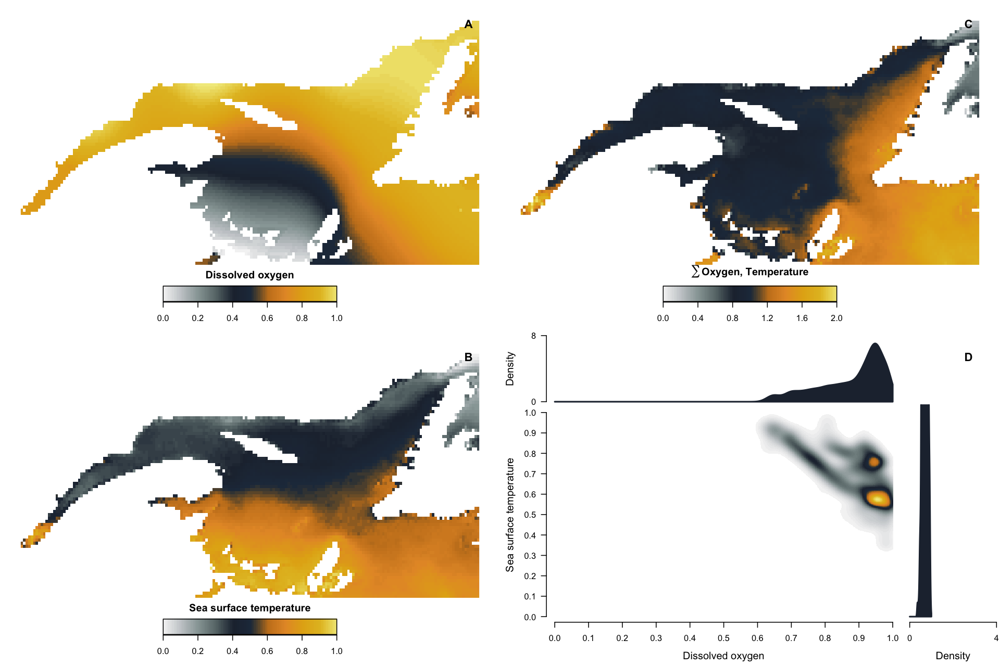

```{r codeChunkSetUp, echo=FALSE}
source('../../../static/Rscript/codeChunkSetUp.R')
```


## Creating a thematic map

In this post, we go through all the steps required to produce a complete good-looking map. We will see how to add a title, a legend, a scale, axis and a North arrow and choose a good color palette. To do so, we will use the Quebec province as our sampled area.

So, first, we import 2 vector layers readily available in R, the Canadian provincial boundaries and USA country boundary.

```{r getdata, message = F}
library(sf)
library(raster)

# Create a new directory
dir.create("data")

can1 <- getData("GADM", country = "CAN", level = 1, path = "data")
usa0 <- getData("GADM", country = "USA", level = 0, path = "data")
```

Transform to `sf` objects to facilitate manipulation

```{r st_sf, message = F}
can1_sf <- st_as_sf(can1)
usa0_sf <- st_as_sf(usa0)
```

Retrieve Quebec polygon and surrounding provinces

```{r getQc, message = F}
qc <- can1_sf[can1_sf$NAME_1 == "Québec",]

qc_neigh <- can1_sf[can1_sf$NAME_1 %in% c("Québec","Ontario", "Nova Scotia","New Brunswick", "Newfoundland and Labrador"),]
```


It would take a while to plot because there is a lot of unnecessary details, so we
can simplify the shape of the polygons using `st_simplify()`.


```{r simplify}
usa0_simple <- st_simplify(usa0_sf, dTolerance = .05, preserveTopology = F)
qc_simple <- st_simplify(qc, dTolerance = .01, preserveTopology = F)
qc_neigh_simple <- st_simplify(qc_neigh, dTolerance = .01, preserveTopology = F)

```


The warning stating that st_simplify does not correctly simplify longitude/latitude data and it should be in decimal degrees. It's important in some spatial operations involving distances, but we can ignore it for the purpose of mapping.

Let's look at what we have :

```{r map_1, message = F, fig.height=4, fig.width=4}
plot(st_geometry(qc_simple), col = "grey85")
plot(st_geometry(qc_neigh_simple),  col = "grey45", add = T)
plot(st_geometry(usa0_simple), col = "grey25", add = T)
```


Let's say we sampled vegetation in 100 plots in Quebec; we now want to plot them with points proportional to their species richness. We will now create a data frame containing coordinates and random values from 5 to 50.

```{r points, message = F}
# Sample random points from our study area
sample_pts <- st_sample(x = qc_simple, size = 100)

# Create an attribute of fake species richness
sample_richness <- sample(x = 5:50, size = 100, replace = TRUE)
```

## Add a temperature raster

If we were interested in the latitudinal temperature gradient, we could add a
raster of mean temperature as a background to our map.
We will use a low resolution so it does not take to long.

```{r temp, message = F}
temp <- getData("worldclim", var = "tmean", res = 10)

# Change projection to match with the polygons
temp <- projectRaster(temp, crs = st_crs(qc_simple)$proj4string)

# There are 12 layers in this raster.
# Keep only the layer for June temperature: tmean6 and divide by 10 (because Worldclim temperature data are in °C * 10)
temp6 <- temp$tmean6/10
```


## Crop and mask the temperature raster using quebec boundary.

First, `crop()` will decrease the extent of the raster using the extent of another spatial object and `mask()` keeps the raster values only in the area of interest and set the rest to NA.
Because `crop()` from `raster` expects a `sp` object we will use transform the polygon first.

```{r crop, message = F}
temp_crop <- crop(temp6, as(qc_simple, "Spatial"))
temp_mask <- mask(temp_crop, qc_simple)
```

## Creating a simple layout

```{r layout}
my.layout <- layout(matrix(1:2, 2), heights = c(1,.14))
layout.show(my.layout)
```

  – `mar` controls the margins of the plot area;

  – `xaxs` and `yaxs` controls axis style.

```{r, eval=T, fig.width = 5.5, fig.height = 6}
library(RColorBrewer)

layout(matrix(1:2, 2), heights = c(1,.16))
par(las = 1, xaxs='i', yaxs='i', mar = rep(c(2.5,3),2))

myblu <- '#6da6c2'
mygre <- 'grey50'
mypal <- colorRampPalette(rev(brewer.pal(11, "RdYlBu")))(124)

plot(st_geometry(qc_neigh_simple),
     graticule = st_crs(qc_simple), # add graticules
     col ='#b5cfbd', border = mygre,
     xlim = c(-82,-56), ylim = c(43, 64))
plot(st_geometry(usa0_simple), col = "#b5cfbd", border = mygre, add = T)

# Temperature raster
image(temp_mask, add = T, col = mypal)

# Quebec boundary on top
plot(st_geometry(qc_simple), add = T, col = NA, border ='grey15', lwd =1.4)

# Sample points
plot(st_geometry(sample_pts), add = T, pch = 21,
     bg = "#63636388", col = "grey15", lwd = 1.4,
     cex = sample_richness/25) # Size proportional to richness

# Axis
axis(1)
axis(2, las = 1)
axis(3)
axis(4, las =1)
box(lwd=1.2)

# Compass rose
sp::compassRose(-57, 60)

# Legend
par(mar = c(3.2, 5, .5, 5), mgp = c(2,.5,0))

val <- range(values(temp_mask), na.rm =T)
image(as.matrix(seq(val[1], val[2], length = 512)), col = mypal, axes = F)
axis(1, at = seq(0.001, .999, length = 6), labels = round(seq(val[1], val[2], length = 6),2))
mtext(side = 1, line = 1.8, text = 'Mean annual temperature (°C)')

```

## Examples of complex layouts

The `layout()` function can be used to produce simple to very complex layouts
for figures. The previous figure was a rather simple example and we will show
two other examples from a scientific article that David is currently wrapping up.
These examples are simply to help visualizing the fact that as long as you can
position elements on a two-dimensional cartesian plane, than you can create
whatever visual you may have in mind with R.  

### Setting data and parameters

Let's begin with getting data! The data for the original figure
is inacessible (for now), so we will access marine abiotic data
using the `sdmpredictors` package. The original figure is however
show at the end of the post, and the data should become openly available
soon.

```{r getData}
library(sdmpredictors)
library(magrittr)
library(MASS)
library(graphicsutils)

# Extent of area of interest
    latmax <- 52.01312
    latmin <- 45.52399
    lonmax <- -55.73636
    lonmin <- -71.06333

# Focal, local area
  xmn <- -67
  xmx <- -63
  ymn <- 49
  ymx <- 51


# Import marine layers
  layers <- c('BO_dissox','BO_sstmean')
  dir.create("downloaded_files/", showWarnings = FALSE)
  envCov <- sdmpredictors::load_layers(layers, datadir = "downloaded_files/", rasterstack = TRUE)

# Crop and build raster stack
  envCov <- raster::crop(envCov, raster::extent(lonmin, lonmax, latmin, latmax)) %>%
            raster::stack()

# Visualize data
  raster::plot(envCov)

# For this graph, we will normalize the values
  values(envCov[[1]]) <- values(envCov[[1]]) / max(values(envCov[[1]]), na.rm = T)
  values(envCov[[2]]) <- values(envCov[[2]]) / max(values(envCov[[2]]), na.rm = T)
```

We will also need certain elements, such as a custom color palette, for this figure.

```{r setParam}
# Color palette
  cols <- c("#f4f4f4","#C7CBCE","#96A3A3","#687677","#222D3D","#25364A",
            "#C77F20","#E69831","#E3AF16","#E4BE29","#F2EA8B")
  rbPal <- colorRampPalette(cols)

# Custom color bar function
colorBar <- function(colRamp, min, max=-min, nticks=11, ticks=seq(min, max, len=nticks), title='', ...) {
    scale = (length(colRamp)-1)/(max-min)
        plot(c(min,max), c(0,1), type='n', bty='n', xaxt='n', xlab='', yaxt='n', ylab='', main=title, ...)
        axis(1, ticks, las=1, ...)
        for (i in 1:(length(colRamp)-1)) {
            y = (i-1)/scale + min
            rect(y,0,y+1/scale,10, col=colRamp[i], border=NA)
        }
}
```

### First example

Now we can build a more complicated figure worthy of a scientific article.
Let's begin with a first layout example for a complex four panel figure.

```{r layout1}
# Layout
mat <- matrix(0, 28, 32)
mat[1:12, 1:16] <- 1
mat[15:26, 1:16] <- 2
mat[1:12, 17:32] <- 3
mat[18:28, 17:29] <- 4
mat[15:17, 17:29] <- 5
mat[18:28, 30:32] <- 6
mat[13:14, 6:11] <- 7
mat[27:28, 6:11] <- 8
mat[13:14, 22:27] <- 9
mat[1:2, 15:16] <- 10
mat[15:16, 15:16] <- 11
mat[1:2, 31:32] <- 12
mat[15:16, 31:32] <- 13
layout(mat)
layout.show(13)
```

The elements on this complex layout will be drawn sequentially following the
order specified in the layout matrix.

```{r figure1, eval = F}
layout(mat)
par(mar = c(2,2,2,2))

# Plot 1
image(envCov[[1]], col = rbPal(100), main = "", axes = F)

# Plot 2
image(envCov[[2]], col = rbPal(100), main = "", axes = F)

# Plot 3
image(envCov[[1]] + envCov[[2]], col = rbPal(100), main = "", axes = F)

# Plot 4
  # Select only values that are not == 0
  notEmpty <- !is.na(values(envCov[[1]]))

  # 2D kernel estimation
  f1 <- kde2d(x = values(envCov[[1]])[notEmpty],
              y = values(envCov[[2]])[notEmpty],
              n = 500, # put 500 for final figure
              lims = c(0, 1, 0, 1))

  par(mar = c(4,4,0,0))
  graphicsutils::plot0(c(0,1))
  image(f1, zlim = c(0,max(f1$z)), col = c('#ffffff', rbPal(99)), add = T)
  axis(1, seq(0,1,0.1), line = -.25, lwd = 0.5)
  axis(2, seq(0,1,0.1), las = 2, line = -0.5, lwd = 0.5)
  mtext('Dissolved oxygen', 1, line = 2.5, font = 1, cex = 0.8)
  mtext('Sea surface temperature', 2, line = 2.5, font = 1, cex = 0.8)

# Plot 5
  dens <- density(values(envCov[[1]])[notEmpty], from = 0, to = 1)
  par(mar = c(0,4,0,0))
  graphicsutils::plot0(c(0,1), c(0,ceiling(max(dens$y))))
  polygon(x = c(dens$x, 1), y = c(dens$y,0), col = cols[5], border = cols[5], lwd=1)
  axis(2, c(0,ceiling(max(dens$y))), lwd = 0.5, line = -0.5, las = 2)
  mtext('Density', 2, line = 2.5, font = 1, cex = 0.8)

# Plot 6
  par(mar = c(4,0,0,0))
  dens <- density(values(envCov[[2]])[notEmpty], from = 0, to = 1)
  graphicsutils::plot0(c(0,ceiling(max(dens$y))), c(0,1))
  polygon(x = c(dens$x, 1), y = c(dens$y,0), col = cols[5], border = cols[5], lwd=1)
  axis(1, c(0,ceiling(max(dens$y))), line = -.25, lwd = 0.5)
  mtext('Density', 1, line = 2.5, font = 1, cex = 0.8)

# plot 7
  par(mar = c(3,0,0,0))
  colorBar(rbPal(100), nticks = 6, min = 0, max = 1, lwd = 0.5)
  rect(xleft = 0, ybottom = 0, xright = 1, ytop = 1, lwd = 0.5)
  mtext('Dissolved oxygen', 3, line = 0.5, font = 2, cex = 0.8)

# plot 8
  par(mar = c(3,0,0,0))
  colorBar(rbPal(100), nticks = 6, min = 0, max = 1, lwd = 0.5)
  rect(xleft = 0, ybottom = 0, xright = 1, ytop = 1, lwd = 0.5)
  mtext('Sea surface temperature', 3, line = 0.5, font = 2, cex = 0.8)

# plot 9
  par(mar = c(3,0,0,0))
  colorBar(rbPal(100), nticks = 6, min = 0, max = 2, lwd = 0.5)
  rect(xleft = 0, ybottom = 0, xright = 2, ytop = 1, lwd = 0.5)
  mtext(expression(bold(sum('Oxygen, Temperature'))), 3, line = 0.5, font = 2, cex = 0.8)

# plot 10 - panel A
par(mar = c(0,0,0,0))
plot0(c(0,1))
text(x = 0.5, y = 0.5, labels = 'A', font = 2, cex = 1.35)

# plot 11 - panel B
par(mar = c(0,0,0,0))
plot0(c(0,1))
text(x = 0.5, y = 0.5, labels = 'B', font = 2, cex = 1.35)

# plot 12 - panel C
par(mar = c(0,0,0,0))
plot0(c(0,1))
text(x = 0.5, y = 0.5, labels = 'C', font = 2, cex = 1.35)

# plot 13 - panel D
par(mar = c(0,0,0,0))
plot0(c(0,1))
text(x = 0.5, y = 0.5, labels = 'D', font = 2, cex = 1.35)
```




<br/>

While it may seem complicated, all of these plot calls are make up each element
of the graph. Before you say *I could do this with photoshop!*, keep in mind that
with this code, I can now change or update the data at will and recreate the
same figure effortlessly.

Here is the actual figure that was built using this complex layout, representing
hypoxia and demersal fisheries intensity in the St. Lawrence and a comparison of
they joint density distribution.

<br/>


<br/>

### Second example

We can now move on to the second example showing that text can also be readily
incorporated into a complex figure layout. Once again, this layout has been used
to generate a figure used in a scientific paper and soon to be submitted for
publication.

<br/>

```{r layout2}
mat  <- matrix(0, 17, 10)
# Arrows
mat[1:3, 1:2] <- 1
mat[1:3, 9:10] <- 2
mat[15:17, 1:2] <- 3
mat[15:17, 9:10] <- 4
mat[9, 1:2] <- 5
mat[9, 9:10] <- 6
# Boxes
mat[4:8, 1:5] <- 7
mat[10:14, 1:5] <- 8
mat[4:8, 6:10] <- 9
mat[10:14, 6:10] <- 10
# Plots
mat[1:3, 3:8] <- 11
mat[15:17, 3:8] <- 12
mat[6:7, 2:3] <- 13
mat[12:13, 2:3] <- 14
mat[6:7, 8:9] <- 15
mat[12:13, 8:9] <- 16
# Text
mat[5, 2:5] <- 17
mat[11, 2:5] <- 18
mat[5, 6:9] <- 19
mat[11, 6:9] <- 20
mat[6:7, 4:5] <- 21
mat[12:13, 4:5] <- 22
mat[6:7, 6:7] <- 23
mat[12:13, 6:7] <- 24
layout(mat,
       heights = c(1,1,1,.2,.2,1,1,.2,.4,.2,.2,1,1,.2,1,1,1),
       widths = c(.2,1,1,1,.5,.5,1,1,1,.2))
layout.show(24)
```

<br/>

```{r figure2, eval = F}
layout(mat,
       heights = c(1,1,1,.2,.2,1,1,.2,.4,.2,.2,1,1,.2,1,1,1),
       widths = c(.2,1,1,1,.5,.5,1,1,1,.2))

# 1
par(mar = c(0,0,0,0))
plot0(c(0,1))
lines(x = c(.5,1), y = c(.5,.5))
lines(x = c(.5,.5), y = c(0,.5))
polygon(x = c(.5,.47,.53,.5), y = c(0,.03,.03,0), col = 'black')
text(x = 1, y = .53, labels = 'Local management', cex = .75, font = 1, adj = c(1,0))

# 2
par(mar = c(0,0,0,0))
plot0(c(0,1))
lines(x = c(0,.5), y = c(.5,.5))
lines(x = c(.5,.5), y = c(0,.5))
polygon(x = c(.5,.47,.53,.5), y = c(0,.03,.03,0), col = 'black')
text(x = 0, y = .53, labels = 'Regional management', cex = .75, font = 1, adj = c(0,0))

# 3
par(mar = c(0,0,0,0))
plot0(c(0,1))
lines(x = c(.5,1), y = c(.5,.5))
lines(x = c(.5,.5), y = c(1,.5))
polygon(x = c(1,.93,.93,1), y = c(.5,.51,.49,.5), col = 'black')

# 4
par(mar = c(0,0,0,0))
plot0(c(0,1))
lines(x = c(0,.5), y = c(.5,.5))
lines(x = c(.5,.5), y = c(1,.5))
polygon(x = c(0,.07,.07,0), y = c(.5,.51,.49,.5), col = 'black')

# 5, 6
for(i in 1:2) {
  par(mar = c(0,0,0,0))
  plot0(c(0,1))
  lines(x = c(.5,.5), y = c(0,1))
  polygon(x = c(.5,.47,.53,.5), y = c(0,.18,.18,0), col = 'black')
}

# 7, 8, 9, 10
for(i in 1:4) {
  par(mar = c(0,0,0,0))
  plot0(c(0,1))
  rect(0,0,1,1, border = 'black')
}

# 11
for(i in 1:2) {
  par(mar = c(1,1,1,1))
  image(envCov[[1]], col = rbPal(100), main = "", axes = F)  
  rect(xmn, ymn, xmx, ymx, lwd = 1, border = '#00000099')
}

#12
par(mar = c(1,1,1,1))
image(envCov[[1]] + envCov[[2]], col = rbPal(100), main = "", axes = F)  
rect(xmn, ymn, xmx, ymx, lwd = 1, border = '#00000099')

# 13, 14
for(i in 1:2) {
  par(mar = c(1.25,1.25,1.25,1.25))
  plot0(x = c(xmn, xmx), y = c(ymn, ymx))
  image(envCov[[1]], col = rbPal(100), main = "", axes = F, add = T)    
  rect(xmn, ymn, xmx, ymx, lwd = 1, border = '#00000099')
}

# 15, 16
for(i in 1:2) {
  par(mar = c(1,1,1,1))
  image(envCov[[2]], col = rbPal(100), main = "", axes = F)  
}

# 17 Title 1
par(mar = c(0,0,0,0))
plot0(c(0,1))
text(x = 0, y = 1, labels = 'Title1 - Year1', cex = 1, font = 2, adj = c(0,1))

# 18 Title 2
par(mar = c(0,0,0,0))
plot0(c(0,1))
text(x = 0, y = 1, labels = 'Title1 - Year2', cex = 1, font = 2, adj = c(0,1))

# 19 Title 3
par(mar = c(0,0,0,0))
plot0(c(0,1))
text(x = 1, y = 1, labels = 'Title2 - Year1', cex = 1, font = 2, adj = c(1,1))

# 20 Title 4
par(mar = c(0,0,0,0))
plot0(c(0,1))
text(x = 1, y = 1, labels = 'Title2 - Year2', cex = 1, font = 2, adj = c(1,1))

# 21, 22, 23, 24
for(i in 1:2) {
  par(mar = c(0.1,0.1,0.1,0.1))
  plot0(x = c(0,1))
  text(x = 0, y = .95, 'Jurisdiction:', cex = 0.75, adj = c(0,1), font = 2)
  text(x = .05, y = .85, '\u2022 Municipal', cex = 0.75, adj = c(0,1))
  text(x = 0, y = .7, 'Spatial distribution:', cex = 0.75, adj = c(0,1), font = 2)
  text(x = .05, y = .6, '\u2022 Local', cex = 0.75, adj = c(0,1))
  text(x = 0, y = .45, 'Data collection protocols:', cex = 0.75, adj = c(0,1), font = 2)
  text(x = .05, y = .35, '\u2022 Non-standardized', cex = 0.75, adj = c(0,1))
  text(x = 0, y = .2, 'Data availability:', cex = 0.75, adj = c(0,1), font = 2)
  text(x = .05, y = .1, '\u2022 Fragmented', cex = 0.75, adj = c(0,1))
}

# 23, 24
for(i in 1:2) {
  par(mar = c(0.1,1,0.1,0.1))
  plot0(x = c(0,1))
  text(x = 0.05, y = .95, 'Jurisdiction:', cex = 0.75, adj = c(0,1), font = 2)
  text(x = 0.1, y = .85, '\u2022 Federal', cex = 0.75, adj = c(0,1))
  text(x = 0.05, y = .70, 'Spatial distribution:', cex = 0.75, adj = c(0,1), font = 2)
  text(x = 0.1, y = .60, '\u2022 Regional', cex = 0.75, adj = c(0,1))
  text(x = 0.05, y = .45, 'Data collection protocols:', cex = 0.75, adj = c(0,1), font = 2)
  text(x = 0.1, y = .35, '\u2022 Standardized', cex = 0.75, adj = c(0,1))
  text(x = 0.05, y = .2, 'Data availability:', cex = 0.75, adj = c(0,1), font = 2)
  text(x = 0.1, y = .1, '\u2022 Regional', cex = 0.75, adj = c(0,1))
}
```


And here is the actual figure!


