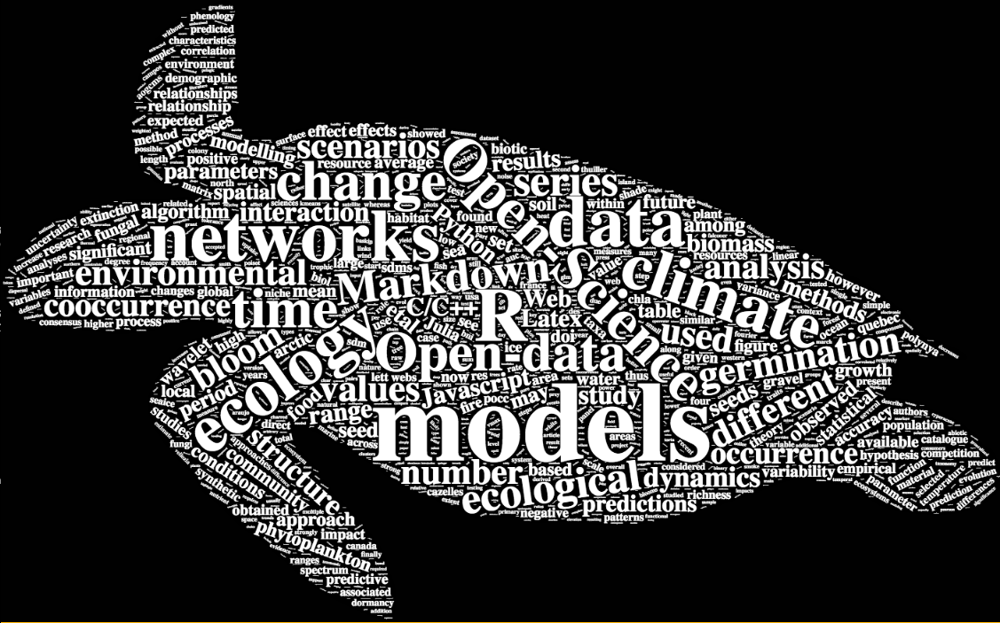

<!-- 
<div id="toc"></div> -->


## Who and where are we?

```{r mapAuthors, fig.width=9.5, echo=FALSE, message=FALSE}
source("Rscripts/mapAuthors.R")
map_aut  # I have to add this the make the map working.
```

[*Learn more*](./about.html)
<br/><br/><br/>


## What are we interested in?

{width=100%}

Wordcloud created with the [wordcloud2 R package](https://github.com/lchiffon/wordcloud2); silhouette image available on [PhyloPic](http://phylopic.org/image/4308027d-b3f6-4b28-80fe-84671e3c8b1d/) (Lepidochelys olivacea)

<br/>

[*Learn more about this website*](./about.html)

<!-- <iframe src="./assets/ourWorcloud.html" height=600 width=800></iframe> -->

<!-- ```{r wordcloud, fig.width=9.5, echo=FALSE, warning=FALSE, message=FALSE, results="asis"}
source("Rscripts/ourWordcloud.R")
wc_aut
cat("Wordcloud created with the [wordcloud2  package](https://github.com/lchiffon/wordcloud2); silhouette image available on [PhyloPic](http://phylopic.org) (*Polyommatus Icarus*).")
``` -->
