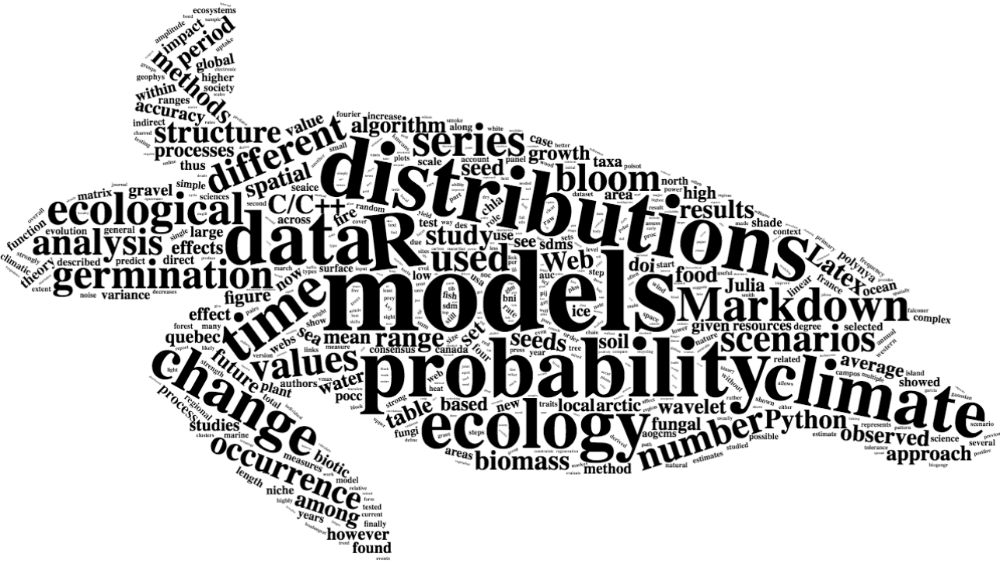

```{r slcLang, echo=FALSE, results="asis", message=FALSE}
source("Rscripts/slcLang.R")
slcLang("index.Rmd")  # I have to add this the make the map working.
source("Rscripts/mapAuthors.R")
```

<br/><br/>

### **Who and where are we?** {lang=us}

### **Qui et où sommes-nous?** {lang=fr}

###

```{r mapAuthorsU, fig.width=9.5, echo=FALSE, message=FALSE}
map_aut  # I have to add this the make the map working.
```

<br/><br/>


### **What are we interested in?** {lang=us}

<br/>

{width=100%}

Wordcloud created with the [wordcloud2 R package](https://github.com/lchiffon/wordcloud2); silhouette image available on [PhyloPic](http://phylopic.org/image/4308027d-b3f6-4b28-80fe-84671e3c8b1d/) (Lepidochelys olivacea)


### **Quels sont nos centres d'intérêt?** {lang=fr}

<br/>

{width=100%}

<!-- <p "lang=eng"> -->
Wordcloud créé à l'aide [package R  wordcloud2](https://github.com/lchiffon/wordcloud2). L'image de fond est disponible sur [PhyloPic](http://phylopic.org/image/4308027d-b3f6-4b28-80fe-84671e3c8b1d/) (Lepidochelys olivacea)

[*En savoir plus](./about.html)
